<!-- ### Hi there 👋 -->
<!-- 

 -->

<h2>I'm Kamil 👋</h2> 

 A work in progress front end developer, passionate about the world of technology and new trends. 

## 🛠️ Skills

 <a href="https://www.w3.org/html/" target="_blank" rel="noreferrer">   </a>     

## 💬 Connect with me

## 📊 Stats

|  |  |
| ------------- | ------------- |

<!--
**kamilronda/kamilronda** is a ✨ _special_ ✨ repository because its `README.md` (this file) appears on your GitHub profile.

Here are some ideas to get you started:

- 🔭 I’m currently working on ...
- 🌱 I’m currently learning ...
- 👯 I’m looking to collaborate on ...
- 🤔 I’m looking for help with ...
- 💬 Ask me about ...
- 📫 How to reach me: ...
- 😄 Pronouns: ...
- ⚡ Fun fact: ...
-->
